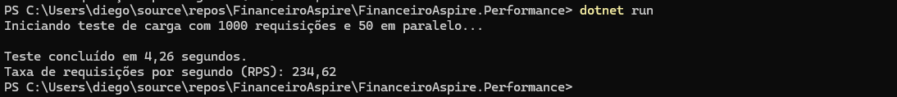
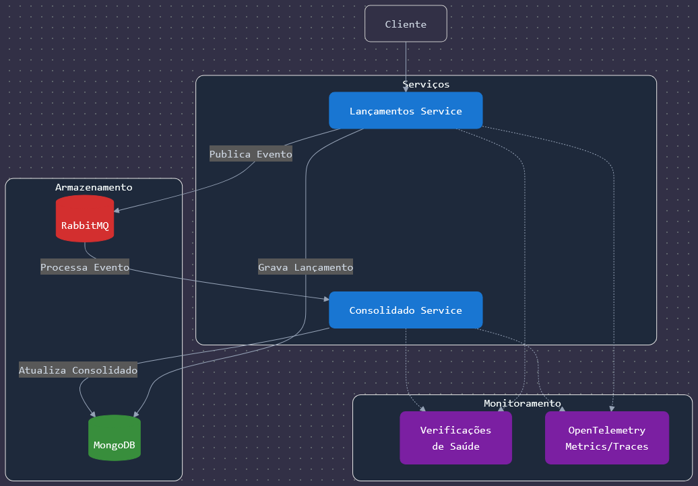
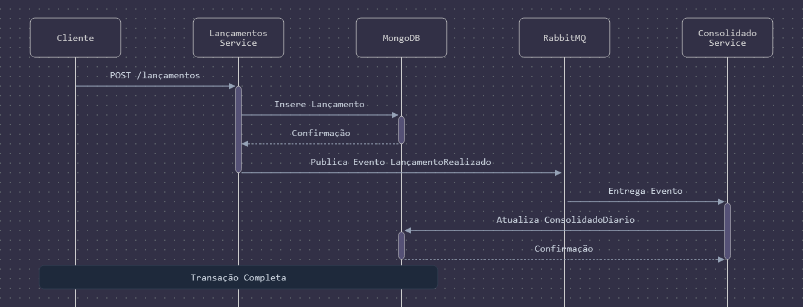

# FinanceiroAspire

## Introdução 

Este documento apresenta a proposta arquitetural para o **FinanceiroAspire**, atendendo aos seguintes requisitos essenciais:

- **Escalabilidade**: Capacidade de lidar com aumento da carga sem comprometer o desempenho.
- **Resiliência**: Tolerância a falhas com estratégias de recuperação robustas.
- **Segurança**: Proteção dos dados e sistemas contra ameaças.
- **Padrões Arquiteturais**: Escolha da melhor abordagem entre microsserviços, monólitos, SOA ou serverless.
- **Integração**: Definição clara dos mecanismos de comunicação entre os componentes.
- **Requisitos Não-Funcionais**: Foco em desempenho, disponibilidade e confiabilidade.
- **Documentação**: Registro de decisões arquiteturais e fluxos de dados.

---

## Visão Geral 

A arquitetura proposta utiliza **[Aspire.net](https://learn.microsoft.com/en-us/dotnet/aspire/get-started/aspire-overview)**, uma abordagem moderna para aplicações distribuídas. Comparado ao **Akka.net**, **Orleans** e desenvolvimento tradicional de microsserviços, o **Aspire.net** foi escolhido por sua **simplicidade na configuração de infraestrutura e facilidade de desenvolvimento**.

A solução emprega:
- **Minimal APIs .NET 8**: Alta performance e código simplificado.
- **RabbitMQ com MassTransit**: Comunicação assíncrona confiável.
- **MongoDB**: Banco de dados escalável e eficiente.

---

## Como executar a aplicação

### Pré-requisitos

- [.NET 8 SDK](https://dotnet.microsoft.com/download/dotnet/8.0)
- [Docker](https://www.docker.com/products/docker-desktop)
- [Docker Compose](https://docs.docker.com/compose/install/)
- [MongoDB Compass](https://www.mongodb.com/try/download/compass)
- [Postman](https://www.postman.com/downloads/)

### Instruções

1. Clone o repositório:
   ```bash
   git clone https://github.com/diego-gimenes-repo/FinanceiroAspire

   cd FinanceiroAspire
   ```
2. Inicie os serviços:
   ```bash
   docker-compose up -d
   ```
3. Execute a aplicação:
   ```bash
   dotnet run --project FinanceiroAspire.AppHost/FinanceiroAspire.AppHost.csproj
   ```
4. Importe a coleção do Postman:
   - Abra o Postman e importe o arquivo `Test Opah.postman_collection.json`.
   - Execute as requisições para testar a aplicação.


### Evidencia de performance


## Arquitetura do Sistema

### Diagrama da Arquitetura


### Explicação do Diagrama

#### Cores dos Componentes
- **Azul**: Serviços principais (*.NET 8 Minimal APIs*).
- **Verde**: Banco de dados (*MongoDB*).
- **Vermelho**: Mensageria (*RabbitMQ* com *[MassTransit](https://masstransit.io/)*).
- **Roxo**: Componentes de monitoramento.

#### Conexões
- **Linhas contínuas**: Fluxo principal de dados.
- **Linhas pontilhadas**: Integrações de monitoramento.

---

## Fluxo das Mensagens



### Benefícios do Fluxo Assíncrono

1. **Alta Disponibilidade**: O serviço de lançamentos responde imediatamente após persistência.  
2. **Desacoplamento**: Serviços operam de forma independente via mensageria.  
3. **Escalabilidade**: Permite escalar serviços individualmente.  
4. **Resiliência**: Falhas em um serviço não afetam diretamente os outros.  

---

## Considerações de Performance

### Minimal API .NET 8
- Maior performance comparado a controllers tradicionais.  
- Menor consumo de memória.  
- Tempo de resposta otimizado.  
- Código mais limpo e de fácil manutenção.  

### MongoDB
- **Collections otimizadas**:
   1. **Lançamentos**: Operações rápidas de inserção.  
   2. **ConsolidadoDiario**: Atualizações atômicas eficientes.  
- Índices estratégicos para consultas rápidas.  
- Replicação configurável para alta disponibilidade.  

### RabbitMQ com MassTransit
- Garantia de entrega de mensagens.  
- Retentativas automáticas em caso de falha.  
- Escalabilidade horizontal do broker.  
- Monitoramento de filas integrado.  


Evidencias do teste de performance no servico consolidado:


---

## Próximos Passos

### 1. Escalabilidade

#### 1.1 Kubernetes (Recomendado para produção)  
- Deployments individuais por serviço.  
- **HPA (Horizontal Pod Autoscaling)** com base em métricas.  
- Rollouts controlados sem downtime.  

#### 1.2 Alternativa: Docker Swarm  
- Serviços globais para componentes críticos.  
- Replicação configurável.  
- Overlay networks para comunicação segura.  

---

### 2. Monitoramento e Observabilidade

#### 2.1 Dashboards personalizados para:
- Tempo de processamento de mensagens.  
- Taxa de transferência do MongoDB.  
- Saúde geral do sistema.  

#### 2.2 Alertas configuráveis para:
- Filas com alto volume.  
- Latência elevada.  
- Falhas no processamento (**DLQ**).  

---

### 3. Segurança

- **Autenticação JWT** para APIs.  
- **Criptografia** de dados sensíveis.  
- **Network Policies** em Kubernetes.  
- **Secrets Management** centralizado.  

---

## Trade-offs e Considerações Finais

### 1. Performance vs Complexidade
- **Ganho significativo** de performance com Minimal APIs.  
- Complexidade extra devido ao sistema distribuído.  

### 2. Custos Operacionais
- Investimento inicial em infraestrutura.  
- Retorno com menor consumo de recursos e manutenção simplificada.  

### 3. Curva de Aprendizado
- Documentação extensa disponível para todas as ferramentas utilizadas.  
- Padrões estabelecidos facilitam a entrada de novos desenvolvedores.  

---

## Conclusão

Esta arquitetura proporciona **alta performance, escalabilidade e manutenibilidade**, sendo ideal para **sistemas financeiros de grande porte**, garantindo processamento assíncrono **rápido e confiável**.
